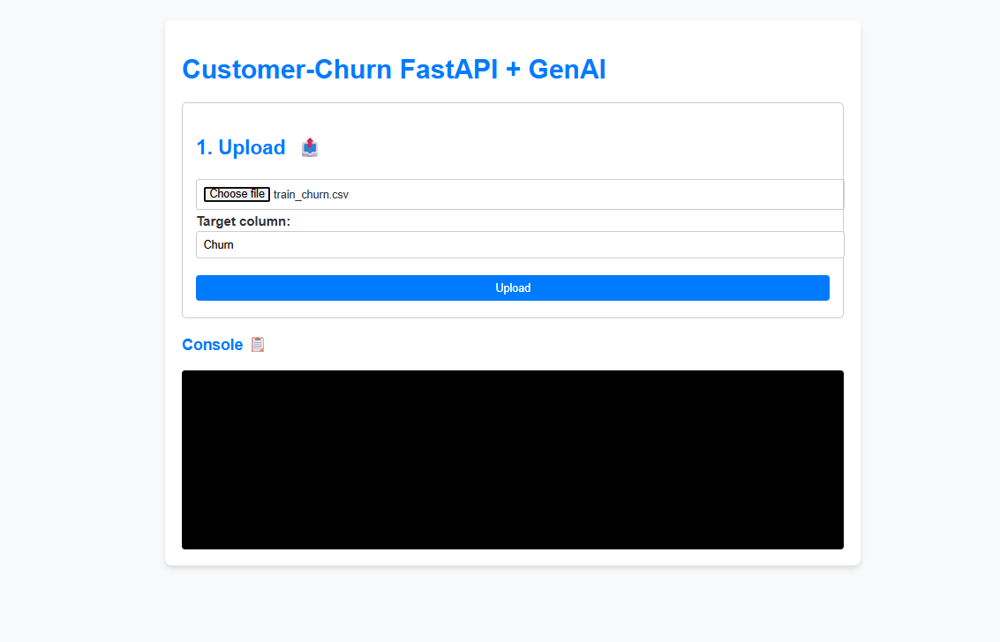
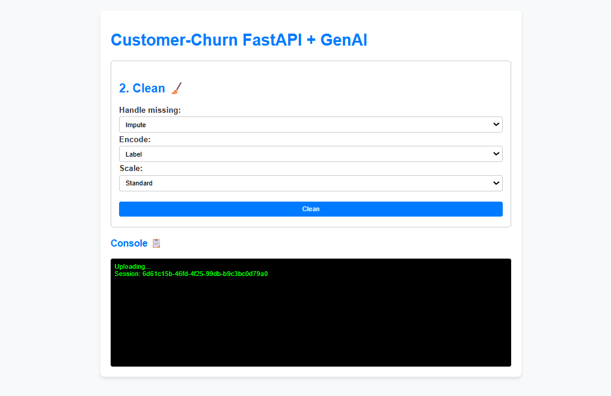
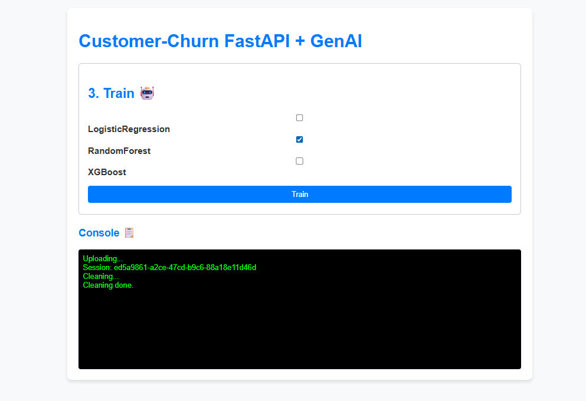
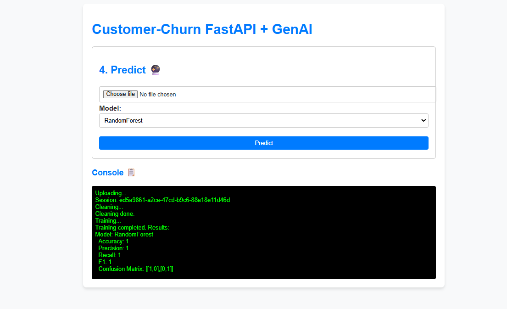
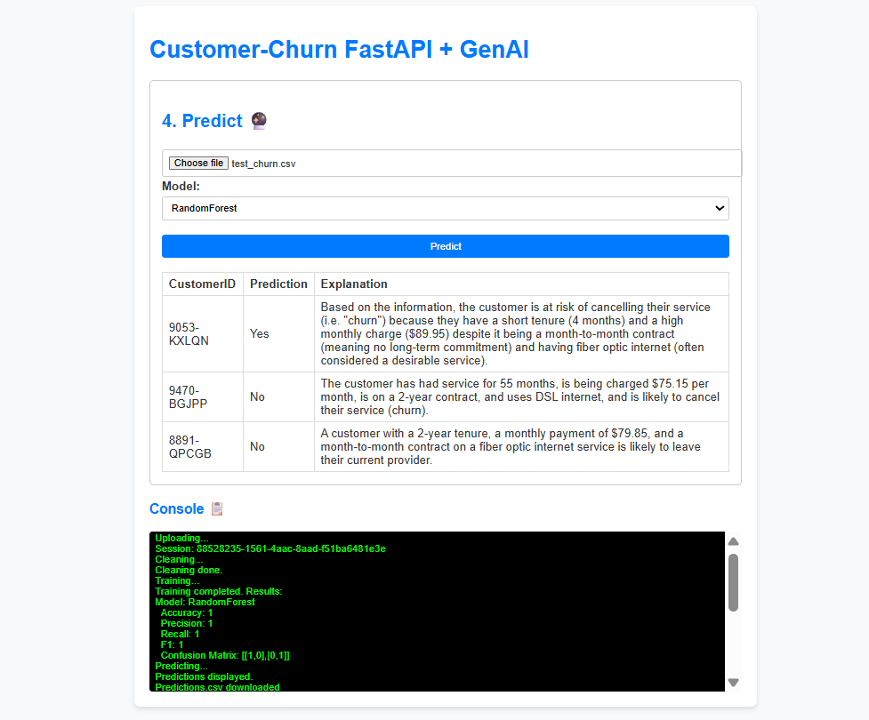

# Customer Churn Prediction

This project is a **Customer Churn Prediction** system built with:

* **Python**
* **FastAPI** for the backend API
* **Random Forest and other ML models**
* Interactive **HTML Frontend** for uploading CSV files and getting predictions

---

## Project Structure

```
customer-churn/
├── app/
│   ├── __pycache__/
│   ├── models/                  # Saved ML models (.joblib)
│   ├── services/
│   │   ├── __pycache__/
│   │   ├── cleaning.py          # Data cleaning utilities
│   │   ├── inference.py         # Prediction pipeline
│   │   ├── llm.py               # LLM-based explanation (if used)
│   │   ├── training.py          # Model training scripts
│   │   ├── main.py              # FastAPI app
│   │   ├── schemas.py           # Pydantic schemas for API
│   │   └── utils.py             # Miscellaneous utility functions
├── examples/                    # Example CSV files for testing
│   ├── predictions.csv
│   ├── test_churn.csv
│   └── train_churn.csv
├── templates/
│   └── index.html               # Frontend HTML page
├── uploads/                     # Uploaded and generated files during usage
│   ├── *.csv
├── requirements.txt             # Python dependencies
└── README.md                    # Project documentation
```

---

## Features

* Train Churn Prediction Models
* Serve Predictions via REST API
* Upload CSV and get predictions with explanations
* Download predictions as CSV
* Interactive Frontend (HTML + JavaScript)

## Setup Instructions

### 1. Clone Repository

```bash
git clone https://github.com/your-repo/customer-churn.git
cd customer-churn
```

### 2. Install Dependencies

```bash
pip install -r requirements.txt
```

### 3. Run FastAPI Server

```bash
uvicorn app.main:app --reload --host 0.0.0.0 --port 8000
```

Server will start on:

```
http://localhost:8000
```

### 4. Access Frontend

Open `templates/index.html` in your browser

or

serve via a simple server:

```bash
python -m http.server 8080
```


## API Endpoints

### POST `/predict`

**Description:** Upload a CSV and select a model to get churn predictions.

**Request:**

* `file`: CSV file
* `model_name`: Name of the model (`RandomForest_pipeline`, etc.)

**Response:**

* CSV file with predictions and explanations.

## Steps

### Upload:


### Cleaning dataset 


### Training


### Prediction




## Example Files

* `examples/test_churn.csv` → Sample input file
* `examples/predictions.csv` → Sample output file


## Technologies Used

* Python 3.x
* FastAPI
* Scikit-learn
* Joblib
* HTML/CSS/JavaScript


